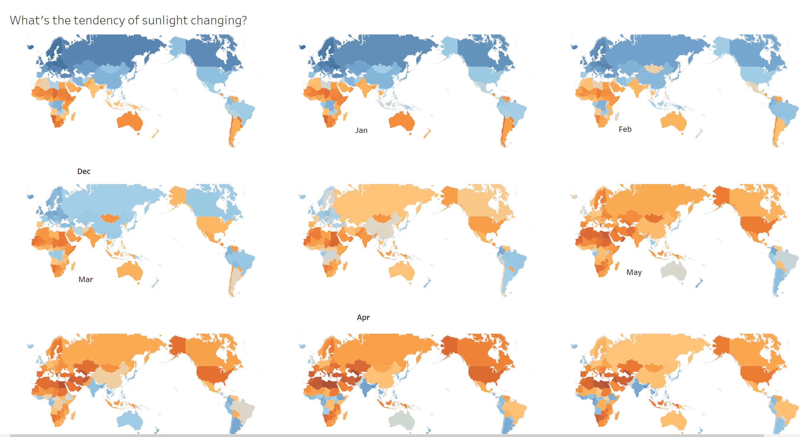
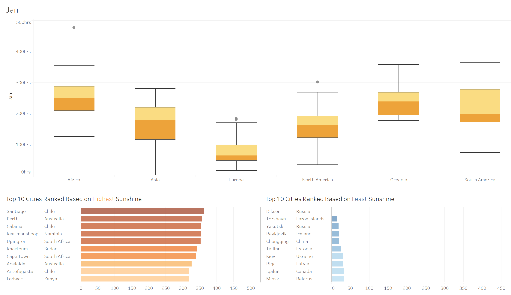

# Interactive dashboards for chasing the Sun
This is the first visualization project I made in Tableau.

## Introduction
The project aims to analyze sunlight data in different cities in the US to help visitors find a suitable holiday location in different seasons.  
There were 13 interactive dashboards in the uploaded Tableau workbook, please download *dashboards* to play around. 

Two sample screenshots.

